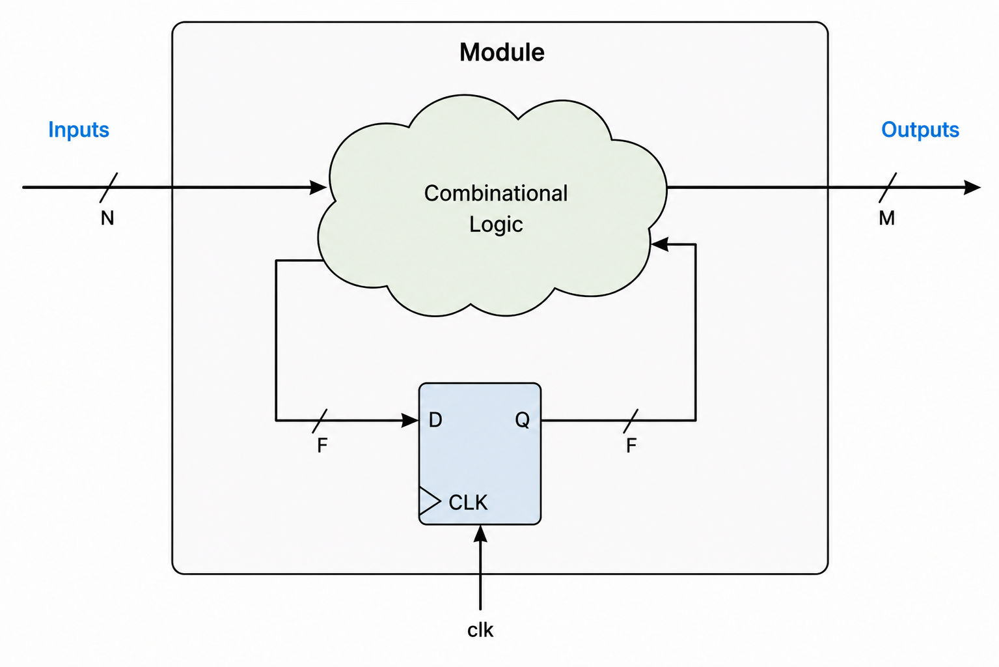

---js
const title = "A minimal IR for RTL";
const date = "2026-07-23";
---

I started working on RTL design for ASIC after some years doing web development.
Coming from an ecosystem that's mature and constantly evolving in languages,
methodologies and frameworks, moving into a field that mostly still feels stuck
in the 1980s really threw me off.

As opinionated as I am, I spent many of my working hours complaining about
Verilog semantics, UVM, tool failures and backwards workflows (anyone
unfortunate enough to have worked with me can confirm this). After many years
complaining, at the beginning of 2026 and I discovered the virtues of agentic
coding and decided to give a try to an idea I had in mind for a long time: a
verilog-like HDL, without all the pain of the original language, with similar
syntax but with extended capabilities.

Being totally ignorant on the topic of programming language/compiler development
(specially due to being an Electronics Engineer by training) I decided to start
by developing a "Verilog compiler", which would then could get "easily extended"
to a new language.

Little did I know this side project would get me almost obsessed to the point of
still being working on it 7 months later (AI psychosis?). What ended up
happening is the development of [Mate IR
🧉](https://github.com/miguel9554/mateIR), an IR for synthesizable RTL which
currently has a pretty much complete SystemVerilog compiler and simulator.

# "Compiling" Verilog

One of the things that always feels odd about writing SystemVerilog/VHDL, is how
often the word "infer" is said. You don't declare a flop: you write procedural
code that is then _inferred_ to be a flop. To me this always was so absurd!

A simple 8-bit counter looks like this

```verilog
logic [8-1:0] counter;
always @(posedge clk) counter <= counter+1;
```

Instead of something much more obvious like

```verilog
flop [8-1:0] counter;

assign counter.clk = clk;
assign counter.d = counter.q;
```

These can probably feel like a such small difference or even "syntactic sugar",
but it's not!

* On SystemVerilog we have no difference at the _language_ level between a flop
  or a combinational output: they are both logic or reg (we also have wire but
  it's a different story)
* We don't _declare_ the clock, it must be _inferred_ from the sensitivity list
* Same applies to async reset: we must include it in the sensitivity list _and_
  code the procedural logic in a particular way (giving reset priority)
* We _must_ use Non-Blocking Assignment (NBA) statement inside the procedural
  block if we want to infer clocked logic

The beautiful thing about all these "rules", is that there are not really rules!
They are _conventions_ we _must_ follow if we want Synthesizable RTL. Do we get a
loud and immediate error message if we don't? Of course not! We may get a
warning in the synthesis or linter logs, buried among thousands of other ones.

Of course that with experience, one stops making this mistakes, and can catch
them early in the case of reviewing another's work. My point here is how
_inefficient_ the whole ecosystem is, since we are full of these kind of
footguns all over the place.

These kind of issues are specially problematic when onboarding someone new to
the field: explaining that a "reg" is not actually a register (nice!),
constantly reminding the NBA vs Blocking assign, etc.

# Making the easy difficult (and the difficult impossible)

With industry standard HDLs like SystemVerilog, things that _should_ be easy
like defining a register's clock and reset, the clock domain of a signal or the
reset value of a register, are actually not possible to do _directly_ in the
language, meaning these are not direct properties we set with the language
constructs. Instead, these fundamental properties are _inferred_ from the
procedural programming constructs we use, making what should be the first-class
citizens of the language some inferred properties behind an unnecessary
indirection layer.

You might think that, given this indirection layer and its downsides, maybe we
gain something useful from it, like powerful abstractions and high code reuse.
Well of course not! This was the status of HDL in the 80s and we never evolved
from it. The following are common features of all modern programming languages
and frameworks but impossible to do in SystemVerilog/VHDL (maybe possible per
LRM but impossible due to tooling status):

* Parametrizable functions
* Parametrizable datatypes
* Polymorphism/multiple dispatch
* Iterating over interfaces/structs (reflection in general)
* Parametrizing with file contents (e.g. regmap module parametrizable by
  systemRDL file)

Instead of HDLs focusing on these useful code reuse concepts while making the
basic definitions easy to do, we have languages which are very limited in their
features, and provide the most contrived ways to define the most basic elements.

This shows up concretely in how large designs actually get built. On ASIC, teams
end up writing as much tooling and code-generation infrastructure as RTL itself,
just to get the reuse the language won't give them directly. On FPGA, the same
gap gets filled by vendor GUIs and IP wizards, which solve the problem by hiding
the language entirely instead of fixing it.

An IR sitting underneath the HDL is what actually breaks this tradeoff. Instead
of a single language having to be both minimal enough to guarantee
synthesizability and expressive enough for real reuse, you can split the job:

* The IR and it's compiler takes care of guaranteeing that the description is
  valid synthesizable RTL code
* The HDL can focus on providing high level constructs useful for the developer.
  Knowing how to lower any of this constructs into the IR is sufficient to
  guarantee synthesizability.

# Mealy is all you need

Synthesizable RTL actually _is_ extremely simple. Any RTL block, be it a simple
counter or the top level of a SoC with RISCV cores and custom hardware
accelerators, can be modeled by the following extremely simple system



Just two components:

* A set of registers: these are the elements holding the state (flops, latches).
  They interact with the async signals (clocks, resets), and with the sync
  signals via its data port
* A transfer function: has as inputs the module inputs and the registers
  outputs, and as outputs the module outputs and the flops inputs. This single
  logic function describes the behavior of the _whole_ system.

By defining just these two elements we can implement _any_ digital block:
complex DSP systems, advanced NoCs, SoCs with millions of flops. These are the
two elements we need to define

If this sounds suspiciously simple, that's because it's not a new idea: this is
just a Mealy machine, formalized decades ago in automata theory. Turns out
reinventing the wheel is sometimes a good idea when the wheel was actually good.

# A minimal IR for Synthesizable RTL

Given we can model _any_ Synthesizable RTL block with a mealy machine, a minimal
IR should "just" hold these two elements, and nothing else. Everything else we
can build is an upper layer over these basic elements.

Some of the current IRs for synchronous hardware (CIRCT, FIRRTL) contain many
primitives that are above this minimal Mealy layer. For example, FIFOs and
Memory ares modeled, with concepts such as FIFO depth or memory size, signaling
protocols (FIFO empty/full, read/write protocols) and read/write latencies being
incorporated. On a minimal IR, none of these concepts exists, since we are just
working with registers and the transfer functions connecting them. The details
of the logic implemented by these transfer functions are not relevant. All of
these concepts belong to the upper _functional_ layer.

To make a comparison, I find an IR for synthesizable RTL having a primitive for a
FIFO being equivalent to an IR for programming languages having a primitive for
writing contents to a file. The IR should focus on the basic primitives that
allow _any_ program (circuit) to be generated: a particular program like a file
writer (FIFO) should be made up of these fundamental primitives, not be one of
them.

I find the approach of keeping the IR minimal and as "dumb" as possible, and
delegating the encapsulation/sharing of these concepts in a capable HDL that can
handle these level of abstraction. The definition of the read/write operations,
their latency and size should be able to be encoded in a generic way in the HDL
itself, _not_ in an IR layer.

# Introducing Mate IR 🧉

With the idea of seeing how far I could take this, I sat down and wrote (or,
more honestly, prompted Claude to write) a compiler for it.

The IR itself is exactly the Mealy machine from before: registers, and a
combinational network connecting them to the module's inputs and outputs.
Getting a real compiler to target that shape meant working through a few
decisions the "just two elements" pitch conveniently skips over.

The combinational network ended up being a single, global graph instead of one
per module. This wasn't a decision make upfront but rather a fix to a problem
encountered along the way. The initial approach was to lower each HDL module
independently into registers-plus-DAG, wire the modules together, and you ended
up getting what looks exactly like a combinational loop at every module
boundary.  Merging everything into one graph across the whole design is what
makes that go away.

That graph is also strictly word-level, built from a deliberately small set of
operators: arithmetic (SUB, ADD, MUL), muxing and slicing, and bitwise ops
(AND, OR, XOR). Every one of them has an obvious bit-level lowering, nothing
"clever" is representable at this level. Keeping the operator set this small
keeps the DFG easy to analyze and has an obvious lowering path for synthesis.

Parametrization was one of the SystemVerilog features that was much more work
than it had any right to be. Parameters are resolved entirely at compile time,
so nothing survives into the IR except baked-in constants, but computing them
correctly meant writing something close to a small expression evaluator inside
the compiler. "Just substitute the values in" turned out to be doing a lot of
hiding.

Making clock domains global instead of local labels also took way more work than
expected, but it payed off immediately: once every register's clock is resolved
to a small set of unique global clocks, the crossing points, the registers where
one clock domain hands off to another, just fall out of compilation.  No
separate CDC tool was needed for this, it was a fact obtained early in the
compilation process.

Of course we can't move forward with whatever crossings we find. In this initial
compiler version, you have to provide a file "waiving" each crossing as
intentional, at the same level of hierarchy as the design itself, or compilation
simply doesn't proceed. It's a blunt mechanism for now, just a declared list of
valid crossings, but it's already enough to move CDC from something you check
for after the fact to something you have to state up front. The natural next
step is a static tool that actually reasons about the IR and validates whether a
given crossing is safe, instead of just trusting the waiver. But even without
that yet, the shift in when you're forced to think about timing intent, at the
start of writing the RTL instead of somewhere in signoff, is the part I care
about most.

After compiling smaller designs and a handful of small cores off GitHub, the
real milestone was getting [Ibex Core](https://github.com/lowRISC/ibex) to
compile. It's a real RISC-V core that leans hard on packages, typedefs, and
parametrization. Getting it compiled into Mate IR showed that a Mealy machine
was truly all we need!

## Current status

The SystemVerilog compiler handles a pretty complete slice of the language at
this point: unpacked arrays, enums, structs, interfaces, parametrization,
functions.

On the consumer side there are two things working today. A simulator, which
codegens a C++ model from the resolved IR and wraps it in a small SystemVerilog
shim called over DPI, so it can be dropped straight into any existing
SystemVerilog testbench. And a static analysis tool that, for now, just reports
the hierarchy of registers referencing each global clock. It's a basic shell
more than a checker, but it's built directly on the clock resolution described
above, so the real static checks, the ones that would replace the waiver file
entirely, have a clean foundation to be added on top of.

# Summary

What started some months ago as seeing how far I could take an idea with a
coding agent on my command, ended up being a pretty complete IR for
synthesizable RTL. It is far from being complete or actually useful but it's a
nice simplification over several facts that are currently over complicated.

If any of this is useful or interesting to you, the repo is at
[github.com/miguel9554/mateIR](https://github.com/miguel9554/mateIR). Try to run
it on some design you have, report any errors, tell me why do you think this is
bad (or good!). I'll be writing more about the internals of the IR and the most
complicated parts to get right.
