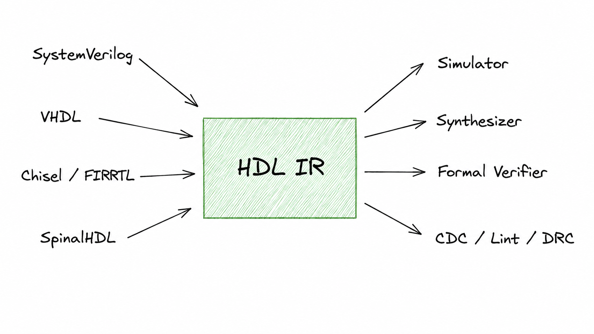
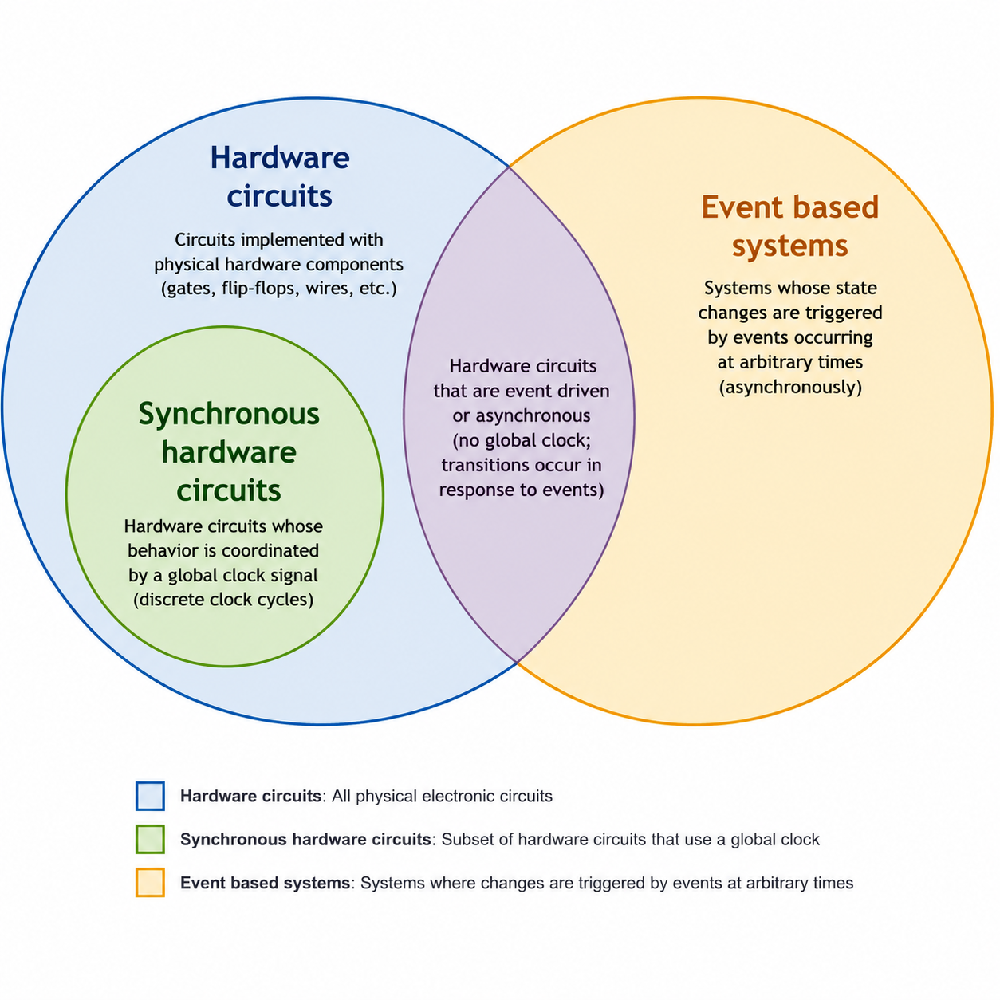

---js
const title = "An IR for Synchronous Hardware";
const date = "2026-06-27";
const draft = true;
---

# Motivation for a IR

The last ~15 years, there has been a great surge in development of HDL languages
* Chisel
* Clash
* Verilog-TL
* Veryl
* Amaranth
* SpinalHDL
* Spade

All of these provide superior characteristics over the current industry standard
languages which are SystemVerilog and VHDL: better semantics (incorporating
registers and combo logic at the language level), better language features,
better code reuse capabilities.

Along these languages, during the same last past years, the most prominent
open-source EDA programs have recibed major development, being capable now of
simulating and synthesizing relatively large designs. Projects like tinytapeout
are consistenly taping out, albeit small, projects using 100% open-source
tooling.

There is however, a disconnect between the innovations in the _frontend_ aspect,
that is, HDLs, and the _backend_ tooling (simulators, synthesizers, etc).
Currenlty, most frontend open source tools support _only_ systemverilog, and not
with full support.

An IR for hardware can solve this issue. Following diagram shows the solution:

Many languages compiling to the IR, and all the consumers working with the IR.
This decouples the job of designing a _HDL_ with the work of developing an EDA
program.

* A simulator developer can focus on simulation speed
* A synthesizer developer can focus on PPA imprevements
* An HDL designer can focus on ergonomics and reuse

And all can benefit of the work of the others! This is the classical improvement
an IR gives, in which N consumers can use M producers _without_ requiring NxM
adapters. This has been the advantage given by LLVM with C, C++, Swift and Rust
languages (just to name a few) being able to reuse the same highly efficient
code generation for distinct targets like x86 or ARM.

In the case of _synchronous hardware_, there is a second benefit to having an
IR, that is to have a _semantic_ IR.

# A semantic IR for Synchronous Hardware

The main industry languages (VHDL and SystemVerilog) carry over an original sin:
they were not thought of and designed as synchronous hardware design languages,
but rather as _simulation_ languages for logic circuits. They mixed a Hardware
Verification Language and a Hardware Design Language into one.

Because of this, the languages do not have native support for fundamental
concepts such as Clocks, resets, combinational logic or power domains. What they
are is languages that work in terms of _events_. That is, they are more general
than a language focused at _just_ describing synchronous hardware. As we see in
this diagram, synchronous hardware circuits (the target design for _any_
ASIC/FPGA design) are a much smaller subset of what these event-based languages
allow to express:

This brings lots of problems and uncertainty to the design process:

* Synthesizable vs non-synthesizable constructs
* Synthesis and simulation mismatches
* Fundamental design aspects as CDC and RDC requiring complex programs

## What is a Semantic IR for Synchronous Hardware?

Synchronous hardware is a very simple system _structurally_. We can define a
synchronous system as a module with just the following components:

* A set of inputs
* A set of outputs
* A set of flops
* A combinational network

Following image shows such a simple system:

What's powerful about DSH is that it can describe systems as complex as modern
TPU or GPUs based on this very simple structural definition!

We'll have later posts explaining the semantic IR in detail. The important point
to note here, is that the IR _must_ already incorporate the concepts of clocks,
resets, registers and combinational logic. This makes compiling from languages
wiithout these concepts harders, but makes the work of _all_ consumers much
easier

* For a simulator, it must _not_ worry about scheduling or races: its only
  concern is advancing the state of the flops and computing the combinational
  network
* For a synthesizer, the first step of generic synthesis has already been done.
  Now its focus is to perform boolean synthesis from word-level operators and
  timing optimization.
