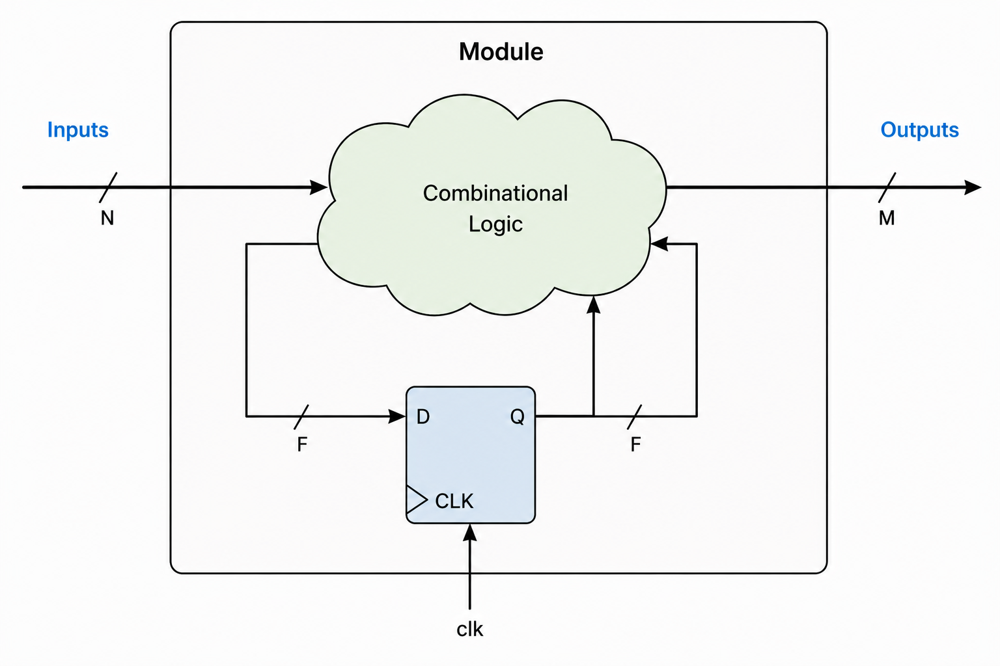

---js
const title = "A minimal IR for RTL";
const date = "2026-07-14";
---

I started working on RTL design for ASIC after some years doing web development.
Coming from an ecosystem that is so mature and always evolving in terms of
languages, methodologies and frameworks, it was shocking in many aspects to
migrate into a field that many times feels stuck in the 1980s.

As opinionated as I am, I spent many of my working hours complaining about
Verilog semantics, UVM, tool failures and backwards workflows (anyone
unfortunate enough to have worked with me can confirm this). For many years
these were just complains, but with the beginning of 2026 and my discovery of
Agentic coding, I decided to give a try to an idea I had in mind for a long
time: a verilog-like HDL, without all the pain of the original language, with
similar syntax but with extended capabilities.

Being totally ignorant on the topic of Programming Language Design (specially
due to being an Electronics Engineer by training, not a computer scientist) I
decided to start by developing a "Verilog compiler", which would then could get
"easily extended" to a new language.

Little did I know this side project would get me almost obsessed to the point of
still being working on it 7 months later (AI psychosis is real!). What ended up
happening is the development of [Mate IR
🧉](https://github.com/miguel9554/mateIR), an IR for synthesizable RTL which
currently has a pretty much complete SystemVerilog compiler.

# "Compiling" Verilog

One of the things that always feels odd about writing SystemVerilog/VHDL, is how
often the word "infer" is said. You don't declare a flop: you write procedural
code that is then _infered_ to be a flop. To me this always was so absurd! To
describe a simple couter we do the following:

```systemverilog
logic [8-1:0] counter;
always @(posedge clk) counter <= counter+1;
```

Instead of something much more obvious like

```systemverilog
flop [8-1:0] counter;

assign counter.clk = clk;
assign counter.d = counter.q;
```

These can probably feel like a such small difference or even "syntactic sugar",
but it's not!

* On SystemVerilog we have no difference at the _language_ level between a flop
  or a combinational output: they are both logic or reg (we also have wire but
  it's a different story)
* We don't _declare_ the clock, it must be _inferred_ from the sensitivity list
* Same applies to async reset: we must include it in the sensitivity list _and_
  code the procedural logic in a particular way (giving reset priority)
* We _must_ use Non-Blocking Assignment (NBA) statement inside the procedural
  block if we want to infer clocked logic

The beautiful thing about all these "rules", is that there are not really rules!
They are _conventions_ we _must_ follow if we want Synthesizable RTL. Do we get a
loud and immediate error message if we don't? Of course not! We may get a
warning in the synthesis or linter logs, buried among thousands of other ones.

Of course that with experience, one stops making this mistakes, and can catch
them early in the case of reviewing another's work. My point here is how
_inefficient_ the whole ecosystem is, since we are full of these kind of
footguns all over the place.

These kind of issues are specially problematic when onboarding someone new to
the field: explaining that a "reg" is not actually a register (nice!),
constantly reminding the NBA vs Blocking assign, etc.

# Making the easy difficult (and the difficult impossible)

With industry standard HDLs like SystemVerilog, things that _should_ be easy
like defining a register's clock and reset, the domain of a signal or reset
value of a register, is actually not possible to do _directly_ in
SystemVerilog/HDL, meaning this are not direct properties we set with the
language. Instead, this fundamental properties are _inferred_ from the
procedural programming constructs we use, making what should be the first-class
citizens of the language some inferred properties behind an unnecessary
indirection layer.

You might think that, given this indirection layer and its downsides, maybe we
gain something useful from it, like powerful abstractions and high code reuse.
Well of course not! This was the status of HDL in the 80s and we never evolved
from it. The following are common features of all modern programming languages
and frameworks but impossible to do in SystemVerilog/VHDL (maybe possible per
LRM but impossible due to tooling status):

* Parametrizable functions
* Parametrizable datatypes
* Polymoprhic/multiple dispatch functions
* Iterating over interfaces/structs (reflection in general)
* Parametrizing with file contents (e.g. regmap module parametrizable by
  systemRDL file)

Instead of languages focusing on these useful code reuse concepts while making
the basic definitios easy to do, we have languages which are very limitied in
their features, and provide the most contrived ways to define the most basic
elements.

This manifests in development of large SoCs/ASIC requiring as much RTL code as
tooling for code generators. The poor capabilities of the language prohibit
from having useful abstractions allowing code reuse beyond simple width
parametrization or conditional module instantiation.

Defining an IR which contains _just_ the bare minimal elements required to
define _any_ synthesizable RTL block, make a good split of responsibilities

* The IR and it's compiler takes care of guaranteeing that the description is
  valid synthesizable RTL code
* The HDL can focus on providing high level constructs useful for the developer.
  Knowing how to lower any of this constructs into the IR is sufficient to
  guarantee synthesizability.

# Mealy is all you need

Synthesizable RTL actually _is_ extremly simple. Any RTL block, be it a simple
counter or the top level of a SoC with RISCV cores and custom hardware
accelerators, can be modeled by the following extremely simple system



Just two components:

* A set of registers: these are the elements holding the state (flops, latches).
  They interact with the async signals (clocks, resets), and with the sync
  signals via its data port
* A transfer function: has as inputs the module inputs and the registers
  outputs, and as outputs the module outputs and the flops inputs. This single
  logic function describes the behavior of the _whole_ system.

By defining just these two elements we can implement _any_ digital block:
complex DSP systems, advanced NoCs, SoCs with millions of flops. These are the
two elements we need to define

If this sounds suspiciously simple, that's because it's not a new idea: this is
just a Mealy machine, formalized decades ago in automata theory. Turns out
reinventing the wheel is a lot less embarrassing when the wheel was already this
good.

# A minimal IR for Synthesizable RTL

Given we can model _any_ Synthesizable RTL block with a mealy machine, a minimal
IR should "just" hold these two elements, and nothing else. Everything else we
can build is an upper layer over these basic elements.

Some of the current IRs for synchronous hardware (CIRCT, FIRRTL) contain many
primitives that are above this minimal Mealy layer. For example, FIFOs and
Memory ares modeled, with concepts such as FIFO depth or memory size, signaling
protocols (FIFO empty/full, read/write protocols) and read/write latencies being
incorporated. On a minimal IR, none of these concepts exists, since we are just
working with registers and the transfer functions connecting them. The details
of the logic implemented by these transfer functions are not relevant. All of
these concepts belong to the upper _functional_ layer.

To make a comparison, I find a IR for synthesizable RTL having a primitive for a
FIFO being equivalent to a IR for programming languages having a primitive for
writing contents to a file. The IR should focus on the basic primitives that
allow _any_ program (circuit) to be generated: a particular program like a file
writer (FIFO) should be made up of these fundamental primitives, not be one of
them.

I find the approach of keeping the IR minimal and as "dumb" as possible, and
delegating the encapsulation/share of these concepts in a fantasy HDL that can
handle these level of abstraction. The definition of latency, read/write
operations and size should be able to be encoded in the HDL language, it should
not be handled by the IR!

# Introducing Mate IR 🧉

With the idea of seeing how far I could take this concept, I sat down and wrote
(or actually prompted Claude to write) a compiler for this conceptual IR.

The IR shape I was targeting is the Mealy Machine described before: a set of
registers, and the combinational logic connecting them and the input and output
ports. So defining this elements was sufficient to define the module.

We merge the inputs and outputs with the declared internal values of the modules
into a group called _nodes_: these are all the observable _combinational_ points
of the module. They carry a datatype and their clock and
reset domains. They also carry a _role_ indicating if they are input, output or
internal. Internal are only for observability purposes, while inputs and outputs
are the point of contact of the module with the outside world.

For the registers, only D flops are supported at the moment: they have a data
type, same as the nodes, and a clock port, an optional async reset port plus
synchronous input and output data ports.

Regarding the datatypes of both the registers and the combinational nodes, there
is support for "complex" datatypes like vectors, structs and enums. 

The hardest part to implement was the combinational network. I went through many
options and the one that made most sense was a DFG of _word_ level operators.
Initially I had a DFG that supported struct or array operands, but in the end
they were not adding anything of value and were hard to maintain. I ended up
opting for _only_ word operands and operators.

The IR nodes _do_ allow for "complex" datatypes like struct or enum, but these
are binded to DFG nodes outside the DFG itself, keeping the DFG word-level.

Being the DFG word-level, a pretty small family of operators was sufficient for
completeness: arithmetic (SUB, ADD, MUL), muxing and slicing, and
bitwise ops (AND, OR, XOR). Restricting it to operators with obvious bit-level
lowering keeps the DFG compact and easy to analyze, while making the eventual
translation to bit-level synthesis straightforward.

Another interesting aspect of the DFG is that it is _global_. The HDL provides a
module hierarchy, and the obvious lowering of each HDL module into a Mealy
Machine with registers + combo network, results in combinational loops on every
module interconnection! To prevent these loops we need to look into the internal
structure of each combinational network. Making the DFG global, that is, merging
all the module DFGs into one not only solves this problem, but allows to
identify better partitions later.

## Clock domains

Since this is a timing-first IR, every combinational signal has attached a clock
domain, indicating to which domain it belongs to. There is an Async domain for
signal with no _known_ clock domain and Static for signals which are static in
time.

The interesting thing about the clock domains is that they are global. There is
a step in the compilation process in which the clocks of all flops are traversed
through the hierarchy to reach to the unique set of global clocks. This means,
in the compiled result, for a flop deep in the design hierarchy, it's clock
domain is not just "this local signal which happens to be a clock" but "this
global clock source". This enables basic CDC checks in the compilation process
itself, and enable complex static validations on the IR itself.

## Current status

With this approach I managed to obtain a compiler from a pretty complete set of
SystemVerilog features: unpacked arrays, enums, structs, interfaces,
parametrization, functions. 

Alongside the compiler into the IR I developed a simulation backend that
consumed a resolved IR. The first simulator was pretty basic: read files for all
inputs, drive them, and generate a VCD with
[cpp-vcd-tracer](https://github.com/nakane1chome/cpp-vcd-tracer). This first
basic simulator allowed to compare our simulated IR output against Verilator,
giving a pass criteria for development.

The next iteration of the simulator was a static codegened C++ library that
provided an interface to simulate the RTL. This interface _intentionally_ has no
management of time, just provides methods to advance clock/resets, and provide
update for synchronous signals on the clock edges.

The current simulation strategy is to codegen a SystemVerilog module with the
same interface as the top RTL module, and inside it call this C++ library via
DPI calls. This way the Mate IR compiled model can be called from any
SystemVerilog Testbench!

The major milestone of the project up until now was compiling [Ibex
Core](https://github.com/lowRISC/ibex) which is a RISCV core using many
"advanced" SystemVerilog features, like packages, all types of typedefs and
parametrizations. It was a pretty good stress test on the compiler!

# Summary

If you got down this far you probably found this interesting and want to know
some more. You can check the IR and compiler in the repo, try to run it for some
design and report some issue or propose an enhancements. In the future I'll try
to make some more posts with more details about the IR design and the
implementation of its components.
